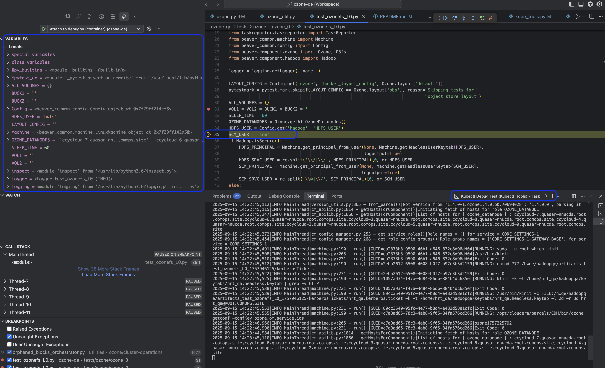

# Kubectl_Tools
External Tool to use in IDE (say Pycharm) to Copy Current Test File/Folder to Kubernetes container.
Also, you can run:
* pytest command on Container directly from IDE.
* Run system-test using /ansible/system_test.yml file
* Run any ansible-playbook on container (E.g. ansible-playbook se-setup.yml)

## How to set up Kubectl Tools in IDE
Refer Pycharm [Create/Edit/Copy Tool Dialog!](https://www.jetbrains.com/help/pycharm/settings-tools-create-edit-copy-tool-dialog.html)

#### Steps to Create External Tools:
* Clone this Repository in your local machine.
* In Pycharm IDE, Go to Preferences (`⌘`+`,`)
* Go to `External Tools` under **Tools** Section
* Click on `+` icon to create a new Tool
* In `Name` field give any name (Say **Kubectl CP**)
* In `Program` field select full path of the `kube_tool*.py` python file as below:
  * For **Kubectl Copy & Run** select `kube_tools.py`
  * For **Kubectl Copy Only** select `kube_tools_copy.py`
  * For **Kubectl Run Only** select `kube_tools_run_test.py`
  * For **Kubectl Debug Test** select `kube_tools_debug_test.py`
* In `Arguments` field enter Two Arguments `$FilePath$` and `$ModuleName$`
* In `Working Directory` field enter `$ProjectFileDir$` or **Kubectl_Tools** Project Dir (Optional)
* Click OK and Apply then you are ready to go!


### How to Run KubeTools from IDE
* Select the file or folder you want to copy or run tests on container.
* Right Click, Go to `External Tools` and Select your `Kubectl Tool`
* That's all! Keep an eye on the Console/Run Tab :)

#### Notes:
* `ktoolrc.ini` file will be auto-generated when you run the script for the first time.
* When you are running the tool for the first time or when you want to change the Pod Name,
Go to `ktoolrc.ini` file at `$ProjectFileDir$` and add/change the value for `podname` field.
* This is one time task per Pod Name change.
* Delete the `ktoolrc.ini` file from your `$ProjectFileDir$`,
if you make any code changes in this repository as all the constants
are picked up by the `ini` file.
* Add `ktoolrc.ini` to your projects `.gitignore` file if required.
* Currently, this tool supports requires Python3+ (As Python2.7 is deprecated)

### Errors:
* `Cannot Run Program /path/kube_tools.py; [error=2] No such file or directory`
  - The files are basically Python scripts. i.e., we use `#!/usr/bin/python3` in the beginning of these script files.
  - Make sure you have **Python3** set to `/usr/bin/python3`.
  - Else Replace the line `#!/usr/bin/python3` in `kube_tools*.py` files, with whichever location you have **Python3** configured.
    - For Eg: `/user/local/bin/python3`

* Unable to run kubectl commands?
  - Before using this tool, make sure you have kubectl package installed in your system.
  - Make sure basic kubectl commands are working on your namespace.

### Debug mode (VS Code)

These are the minimal changes a user needs to run tests in the container under a Python debugger.

- Configure `ktoolrc.ini`
  - Set your pod and optional namespace under `[container]`.
  - Optionally set the debug port (default `5678`) under `[command]`.

```ini
[container]
podname = <your-pod-name>
namespace = <your-namespace>

[command]
debug_port = 5678
```

- Add VS Code debug configuration in `ozone-qe/.vscode/launch.json`

```json
{
  "version": "0.2.0",
  "configurations": [
    {
      "name": "Attach to debugpy (container)",
      "type": "python",
      "request": "attach",
      "connect": { "host": "127.0.0.1", "port": 5678 },
      "justMyCode": false,
      "subProcess": true,
      "pathMappings": [
        { "localRoot": "${workspaceFolder:ozone-qe}", "remoteRoot": "/hwqe/hadoopqe" }
      ]
    }
  ]
}
```

Note: Update absolute paths
- Set workspace variables, prefer `${workspaceFolder:Kubectl_Tools}` and `${workspaceFolder:ozone-qe}` to avoid hardcoded paths.
- If your tasks/launch configs reference absolute script paths like `${workspaceFolder:ozone-qe}...`, update them to your environment.

#### Multi-root workspace variables (recommended)

Open a workspace that includes both repos (File → Open Workspace). Example `ozone-qe.code-workspace`:

```json
{
  "folders": [
    { "name": "Kubectl_Tools", "path": "../Kubectl_Tools" },
    { "name": "ozone-qe", "path": "ozone-qe" }
  ]
}
```

- Run a debug session
  1. Set breakpoints in your test file in `ozone-qe`.
  2. Run the task "Kubectl Debug Test".
  3. Start the VS Code configuration "Attach to debugpy (container)" or Run Debugger.
  4. Execution will pause at breakpoints.

Example (attached and paused at a breakpoint):



- What the tool does automatically
  - Copies your test into the container and maps the destination path.
  - Ensures `debugpy` is installed inside the container.
  - Starts `kubectl port-forward` in the background to `${debug_port}` (log: `/tmp/kpf_<pod>_<port>.log`).
  - Launches pytest with `--wait-for-client` so you can attach before execution.

- Troubleshooting
  - Port check: `nc -vz 127.0.0.1 5678` should succeed while waiting.
  - If breakpoints don't bind, verify `pathMappings` match container path (`/hwqe/hadoopqe`).
  - As a probe, add `import debugpy; debugpy.breakpoint()` near the start of the test.